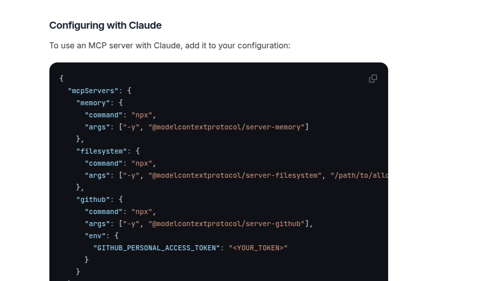

## Introduction

This repo now includes 2 parts:
1. Lite mcp sdk for javascript
2. Lite mcp for javascript

### Project Goal
The goal of this project is to make best of the AI Agent tech available to any **Grandma**👵 who learned 5 minutes of javascript.

### Why javascript?
Because I want the project to condense on the running logics, rather than distracted by the types.

## Lite mcp for javascript Introduction
[](https://www.npmjs.com/package/lite-mcp-sdk)
[](https://shields.io/)
[](https://shields.io/)
[](code_of_conduct.md)


Lite mcp for javascript is the **BEST** yet way to start a REMOTE **SSE** 
javascript MCP server and Client.

### 🚀 Quick start
REAL **COPY AND PASTE** experince for you to get started with MCP.

### Installation
```bash
npm install litemcpjs
npm install express
npm install cors
```

### Build a SSE MCP client under 5 lines
```javascript
import { MCPClient } from "litemcpjs";

async function main() {
  const client = new MCPClient("http://localhost:3000") // change this to your server url
  await client.connect()
  await client.listTools()
  const result = await client.callTool("calculate-bmi", {weightKg: 70, heightM: 1.75})
  console.log(result)
}

main();
```

### Start a REMOTE MCP SSE server with expressJS
```javascript
const { MCPServerInit } = require("litemcpjs");

// define the tools
const TOOLS = [
    {
        name: "calculate-bmi",
        description: "Calculate the BMI of a person",
        inputSchema: {
            type: "object",
            properties: {
                weightKg: { type: "number" },
                heightM: { type: "number" },
            },
            required: ["weightKg", "heightM"],
        },
        method: async ({ weightKg, heightM }) => {
            return {
                content: [{
                    type: "text",                
                    text: String(weightKg / (heightM * heightM))
                }]
            }
        }
    }
];

// define extra handlers for resources etc.
const handlers = {};

// compatible for server have .use(middleware) method such as express
const middlewares = [
    cors(),
];

const MCPapp = express();  

const MCPServer = MCPServerInit(
    MCPapp,
    middlewares,
    handlers,
    TOOLS,
).listen(5556);
```


## Lite mcp sdk for javascript Introduction
[](https://www.npmjs.com/package/lite-mcp-sdk)
[](https://shields.io/)
[](https://shields.io/)
[](code_of_conduct.md)

For Anyone wants a little **more low level control** over the MCP protocol:

Lite mcp sdk for javascript is a lightweight mcp sdk **remix** with minimal dependencies.

### Quick start

```bash
npm install lite-mcp-sdk
```

### Server
```javascript
const { Server, SSEServerTransport } = require("lite-mcp-sdk");

//or module import
import { Server, SSEServerTransport } from "lite-mcp-sdk";

//create a server
const server = new Server({
    port: 3000,
    transport: new SSEServerTransport(),
});


// 1. Define the server info
const server = new Server({
    name: "example-servers/puppeteer",
    version: "0.1.0",
}, {
    capabilities: {
        resources: {},
        tools: {},
    },
});

// 2. Define the request handlers
server.setRequestHandler("tools/call", async (request) => {
    const { name, arguments: args } = request.params;
    return handleToolCall(name, args);
});

//3. Define the transport
const transports = new Map();
const transport = new SSEServerTransport("/messages", res);
transports.set(clientId, transport);

//4. Connect the server to the transport
await server.connect(transport);

//5. Handle the post message
await transport.handlePostMessage(req, res);
```

### Client

```javascript
import { Client, SSEClientTransport } from "lite-mcp-sdk";

// 1. Define the client
let client = new Client( {
      name: "fastmcp-client",
      version: "0.1.0"
    }, {
      capabilities: {
        sampling: {},
        roots: {
          listChanged: true,
        },
      },
    } );

// 2. Init the client transport
const serverUrl = "http://localhost:3000"; // for example

const backendUrl = new URL(`${serverUrl}/sse`);
  
backendUrl.searchParams.append("transportType", "sse");

backendUrl.searchParams.append("url", `${serverUrl}/sse`);

const headers = {};

const clientTransport = new SSEClientTransport(backendUrl, {
    eventSourceInit: {
        fetch: (url, init) => fetch(url, { ...init, headers }),
    },
    requestInit: {
        headers,
    },
});

// 3. Connect the client to the transport
await client.connect(clientTransport);
const abortController = new AbortController();
let progressTokenRef = 0;

// 4. start the tool call
const name = "toolcall name";
const params = {}; // tool call params

const response = await client.request(
    {
          method: "tools/call",
          params: {
            name,
            arguments: params,
            _meta: {
              progressToken: progressTokenRef++,
            },
          },
    },
    {signal: abortController.signal,}
);
```

## Project structure:
The project is clearly and cleanlyorganized into the following directories:
```shell
src
├── index.js
└── lib
    ├── client
    │   ├── client.js
    │   └── clientTransport.js
    ├── server
    │   ├── server.js
    │   └── serverTransport.js
    └── shared
        ├── helpers
        │   ├── constants.js
        │   └── util.js
        ├── protocol.js
        └── validators
            ├── capabilityValidators.js
            └── schemaValidators.js (IN CONSTRUCTION)
```
## Why choose lite-mcp-sdk?

### 1. No fixed zod types
NO More zod types!!! zod types contributes to unneccessary complexity for easy setups. 

Furthermore, the way zod type is used in the original sdk is rigid and not flexible, and it is an well received issue.


### 2. Fully SSE solution

Focus on **SSE**, and removed stdio support for simplicity considerations, since it is not a as univerial solution as SSE.

Suprisingly, the SSE solution is scarce on the internet, so I decided to write my own.

BELOW images shows that stdio support is always descripted, but no SSE support is mentioned.


Even when you search deliberately for SSE, result is scarce, SEE for first page google results.


Replace codes like requestSchema.parse to fully customizable validators and hand it over to the user to define the validation logic here. e.g.
```javascript
const validatedMessage = validator(message);
```

How timeout is used in original sdk is vague and has some redundant implementations,which are removed in lite mcp for not causing further confusion.(Ok I think they also removed these in latest version)

### 3. More detailed documentation on how to quickly get started
They actually listed this problem in the official roadmap. lol


Lite MCP SDK provides better documentation on how to use and modify the sdk, with more ready to copy code examples.

### 4. Cleaner architecthure with only core functionalities
Lite MCP SDK:
```shell
src
├── index.js
└── lib
    ├── client
    │   ├── client.js
    │   └── clientTransport.js
    ├── server
    │   ├── server.js
    │   └── serverTransport.js
    └── shared
        ├── helpers
        │   ├── constants.js
        │   └── util.js
        ├── protocol.js
        └── validators
            ├── capabilityValidators.js
            └── schemaValidators.js (IN CONSTRUCTION)
```
Official sdk:
Although it is listed on the roadmap, I think putting auth in this project is poor product design. 

Honestly I think left users to handle auth problem provides more flexibility and better dev experience.
```shell
src/
├── client
│   ├── auth.test.ts
│   ├── auth.ts
│   ├── cross-spawn.test.ts
│   ├── index.test.ts
│   ├── index.ts
│   ├── sse.test.ts
│   ├── sse.ts
│   ├── stdio.test.ts
│   ├── stdio.ts
│   └── websocket.ts
├── cli.ts
├── inMemory.test.ts
├── inMemory.ts
├── integration-tests
│   └── process-cleanup.test.ts
├── server
│   ├── auth
│   │   ├── clients.ts
│   │   ├── errors.ts
│   │   ├── handlers
│   │   │   ├── authorize.test.ts
│   │   │   ├── authorize.ts
│   │   │   ├── metadata.test.ts
│   │   │   ├── metadata.ts
│   │   │   ├── register.test.ts
│   │   │   ├── register.ts
│   │   │   ├── revoke.test.ts
│   │   │   ├── revoke.ts
│   │   │   ├── token.test.ts
│   │   │   └── token.ts
│   │   ├── middleware
│   │   │   ├── allowedMethods.test.ts
│   │   │   ├── allowedMethods.ts
│   │   │   ├── bearerAuth.test.ts
│   │   │   ├── bearerAuth.ts
│   │   │   ├── clientAuth.test.ts
│   │   │   └── clientAuth.ts
│   │   ├── provider.ts
│   │   ├── router.test.ts
│   │   ├── router.ts
│   │   └── types.ts
│   ├── completable.test.ts
│   ├── completable.ts
│   ├── index.test.ts
│   ├── index.ts
│   ├── mcp.test.ts
│   ├── mcp.ts
│   ├── sse.ts
│   ├── stdio.test.ts
│   └── stdio.ts
├── shared
│   ├── auth.ts
│   ├── protocol.test.ts
│   ├── protocol.ts
│   ├── stdio.test.ts
│   ├── stdio.ts
│   ├── transport.ts
│   ├── uriTemplate.test.ts
│   └── uriTemplate.ts
└── types.ts
```

### Key Difference Table

| Feature | mcp-official-sdk | lite-mcp-sdk |
|---------|----------|-------------|
| Validation | zod | Validators |
| Transport | stdio or SSE | SSE only |
| Language | typescript | javascript |
| Auth | included | optional |
| Documentation | vague | clear |
| Architecture | complex | lightweight |


## 🗺️ Roadmap

- [ ] Custom Validators (under construction)
- [ ] Add dashboard for monitoring and managing the MCP server and client
- [ ] Add ts types
- [ ] Add python sdk


## 🤝 Contributing

Contributions are welcome! Please open an issue or submit a pull request.

Please read the [contributing document](https://github.com/S2thend/Lite_MCP_sdk/blob/main/CONTRIBUTING.md).

## 📝 Licensing

This project is licensed under the MIT License. See the [LICENSE](LICENSE) file for details.

Inspired by Original anthropic sdk,which license is also included [here](./docs/misc/MCP_TS_SDK_LICENSE_ANTHROPIC).

## Contact

If you have any questions or suggestions, please leave a comment [here](https://github.com/S2thend/Lite_MCP_sdk/issues/3).
Or contact me via email: borui_cai@qq.com

## Projects using lite-mcp-sdk (to add)
